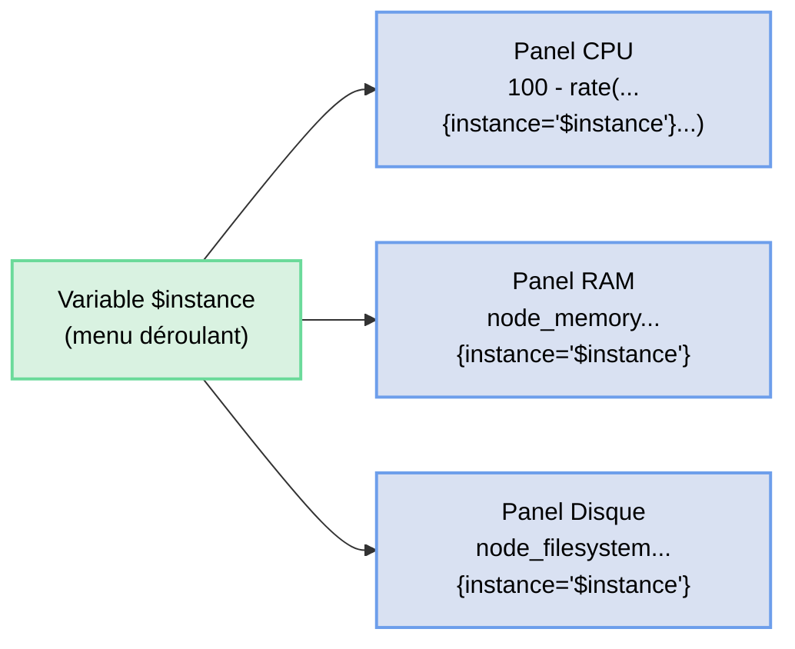

# Variables de template dans Grafana

Un dashboard statique qui affiche les métriques d'une seule machine, c'est bien. Mais en production, vous pouvez avoir des dizaines de serveurs. Les **variables de template** permettent de rendre un dashboard dynamique : un seul dashboard peut s'adapter à n'importe quel serveur ou job par simple sélection dans un menu déroulant.

## Comprendre les variables



👉 La variable `$instance` est injectée dans toutes les requêtes PromQL. Changer sa valeur dans le menu met à jour tous les panels automatiquement.

## Types de variables

| Type | Description | Exemple |
|------|-------------|---------|
| **Query** | Valeurs issues d'une requête PromQL | Liste des instances scrapées |
| **Custom** | Valeurs saisies manuellement | `prod,staging,dev` |
| **Constant** | Valeur fixe réutilisable | URL d'un environnement |
| **Textbox** | Zone de texte libre | Filtre regex custom |
| **Interval** | Intervalles de temps | `1m,5m,15m,1h` |

## Exercice : Rendre le dashboard dynamique

Nous allons ajouter une variable `instance` à votre dashboard **"Monitoring complet"** pour pouvoir sélectionner le serveur à afficher.

### 1. Ouvrir les paramètres du dashboard

Dans votre dashboard **"Monitoring complet"** :  
👉 Cliquez sur l'icône ⚙️ **Dashboard settings** (en haut à droite)

### 2. Créer une variable

Dans le menu de gauche :  
👉 **Variables → Add variable**

Remplissez les champs :

| Champ | Valeur |
|-------|--------|
| Type | `Query` |
| Name | `instance` |
| Label | `Serveur` |
| Data source | `Prometheus` |
| Query | `label_values(up, instance)` |
| Refresh | `On dashboard load` |

Cliquez sur **Apply**.

### 3. Utiliser la variable dans les requêtes

Revenez au dashboard et éditez le panel **CPU Usage**.

Modifiez la requête PromQL pour utiliser la variable :

```promql
100 - (avg by(instance) (rate(node_cpu_seconds_total{mode="idle", instance="$instance"}[5m])) * 100)
```

Sauvegardez le panel.

👉 Un menu déroulant **Serveur** est maintenant visible en haut du dashboard. Sélectionnez une instance pour filtrer les données.

**Réponse — Listez les instances disponibles dans votre menu :**

    92.39.63.52:9100, 92.39.63.52:3000 et prometheus:9090


### 4. Ajouter une variable `job`

Créez une deuxième variable pour filtrer par job Prometheus.

| Champ | Valeur |
|-------|--------|
| Type | `Query` |
| Name | `job` |
| Label | `Job` |
| Query | `label_values(up, job)` |

**Réponse — Quels jobs apparaissent dans le menu ?**

    (votre réponse ici)


### 5. Variable d'intervalle pour le rate()

Créez une variable pour contrôler l'intervalle utilisé dans les fonctions `rate()`.

| Champ | Valeur |
|-------|--------|
| Type | `Interval` |
| Name | `interval` |
| Label | `Intervalle` |
| Values | `1m,5m,15m,30m,1h` |
| Auto option | activé |

Modifiez ensuite la requête du panel **Requêtes HTTP/s** :

```promql
sum by(route) (rate(http_requests_total[$interval]))
```

**Réponse — Que se passe-t-il si vous choisissez un intervalle de 1m vs 30m ?**

    (votre réponse ici)


## Annotations

Les **annotations** permettent d'afficher des événements ponctuels sur vos graphiques (déploiement, incident, redémarrage…). Elles ajoutent une ligne verticale sur les panels Time series.

### Ajouter une annotation manuelle

1. Dans **Dashboard settings → Annotations → Add annotation query**
2. Remplissez :

| Champ | Valeur |
|-------|--------|
| Name | `Événements` |
| Data source | `-- Grafana --` |

3. Cliquez sur **Apply**

4. Sur votre dashboard, faites **Ctrl + clic** sur un graphique pour ajouter une annotation.

**Réponse — A quoi cela peut-il servir en production ?**

    (votre réponse ici)


## Résultat

Votre dashboard est maintenant :
- **dynamique** : il s'adapte à n'importe quelle instance ou job
- **paramétrable** : l'intervalle de rate() est ajustable sans modifier les requêtes
- **annoté** : vous pouvez marquer des événements importants

Un seul dashboard peut désormais servir pour tous vos serveurs. C'est la puissance des variables Grafana.
