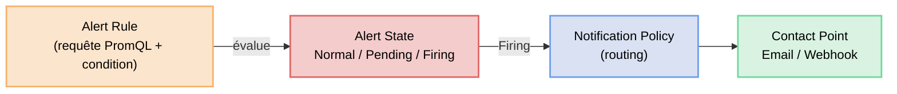
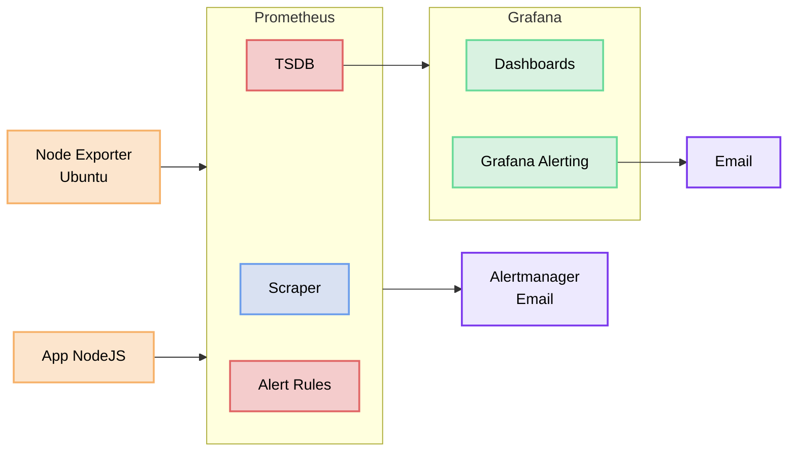

# Alertes dans Grafana

Prometheus possède son propre système d'alertes (Alertmanager). Grafana intègre également un moteur d'alertes natif, **Grafana Alerting**, qui permet de définir des alertes directement depuis l'interface et de les centraliser avec les dashboards.

## Grafana Alerting vs Prometheus Alertmanager

| | Grafana Alerting | Prometheus + Alertmanager |
|-|-----------------|--------------------------|
| **Configuration** | Interface graphique | Fichiers YAML |
| **Sources de données** | Multi-sources (Prometheus, Loki…) | Prometheus uniquement |
| **Routing** | Contact points + policies | Routes Alertmanager |
| **Silences** | Interface graphique | Interface Alertmanager |
| **Usage recommandé** | Petites/moyennes stacks, multi-sources | Grandes stacks, infra-as-code |

👉 Les deux approches sont complémentaires. En entreprise, on utilise souvent les deux.

## Architecture de Grafana Alerting



| Concept | Description |
|---------|-------------|
| **Alert Rule** | Requête PromQL + condition de déclenchement |
| **Alert State** | État de l'alerte : Normal, Pending, Firing |
| **Contact Point** | Canal de notification (email, webhook…) |
| **Notification Policy** | Règles de routage : quelle alerte → quel contact |
| **Silence** | Mise en pause temporaire d'une alerte |

## Configurer le SMTP Gmail

Pour que Grafana puisse envoyer des emails, il faut lui fournir un serveur SMTP. Nous allons utiliser Gmail, qui offre un relai SMTP gratuit via les **mots de passe d'application**.

### 1. Créer un compte Gmail dédié

Il est recommandé de créer un compte Gmail spécifique aux alertes plutôt que d'utiliser un compte personnel.

👉 Rendez-vous sur [https://accounts.google.com/signup](https://accounts.google.com/signup) et créez un compte du type :  
`monitoring.alerts.monlabo@gmail.com`

### 2. Activer la validation en 2 étapes (2FA)

Les mots de passe d'application nécessitent que la 2FA soit activée sur le compte.

1. Connectez-vous au compte Gmail créé
2. Accédez à **Gérer votre compte Google → Sécurité**
3. Dans la section **Comment vous vous connectez à Google**, cliquez sur **Validation en 2 étapes**
4. Suivez les étapes pour activer la 2FA (SMS ou application d'authentification)

### 3. Créer un mot de passe d'application

Un mot de passe d'application est un code à 16 caractères généré par Google, utilisé à la place du mot de passe principal pour les applications tierces.

1. Toujours dans **Sécurité**, cherchez **Mots de passe des applications**  
   *(visible uniquement si la 2FA est activée)*
2. Dans le champ **Sélectionner une application**, saisissez un nom (ex : `Grafana`)
3. Cliquez sur **Créer**
4. Google affiche un mot de passe sous la forme `xxxx xxxx xxxx xxxx`

> Copiez ce mot de passe immédiatement — il ne sera affiché qu'une seule fois.

**Réponse — Avez-vous bien obtenu un mot de passe d'application à 16 caractères ?**

    oui

---

### 4. Adapter le docker-compose

Ajoutez les variables d'environnement SMTP au service Grafana dans votre `docker-compose.yml` :

**IMPORTANT: Pour GF_SMTP_PASSWORD, mettez le mdp sans espace.**

```yaml

    environment:

      # Configuration SMTP Gmail
      - GF_SMTP_ENABLED=true                              # Active le serveur SMTP dans Grafana
      - GF_SMTP_HOST=smtp.gmail.com:587                   # Serveur Gmail avec port STARTTLS
      - GF_SMTP_USER=monitoring.alerts.monlabo@gmail.com  # Adresse Gmail du compte émetteur
      - GF_SMTP_PASSWORD=xxxxxxxxxxxxxxxx              # Mot de passe d'application (sans espaces)
      - GF_SMTP_FROM_ADDRESS=monitoring.alerts.monlabo@gmail.com  # Adresse affichée dans les emails
      - GF_SMTP_FROM_NAME=Grafana Alerts                  # Nom affiché dans les emails
      - GF_SMTP_STARTTLS_POLICY=MandatoryStartTLS         # Force le chiffrement STARTTLS

```

> Remplacez `monitoring.alerts.monlabo@gmail.com` par votre adresse et `xxxx xxxx xxxx xxxx` par le mot de passe d'application obtenu à l'étape précédente (retirez les espaces).

Relancez la stack pour appliquer la configuration :

```bash
docker compose down
docker compose up -d
```

Vérifiez que Grafana a démarré sans erreur :

```bash
docker compose logs grafana | grep -i smtp
```

Vous devez voir une ligne confirmant que le SMTP est initialisé sans erreur.

**Réponse — Quelle ligne de log confirme que le SMTP est bien chargé ?**

    (votre réponse ici)

---

## Configurer un Contact Point

Avant de créer des alertes, il faut définir où les notifications seront envoyées.

### 1. Accéder aux Contact Points

Dans le menu de gauche :  
👉 **Alerting → Contact points**

### 2. Créer un Contact Point Email

Cliquez sur **Add contact point** et remplissez :

| Champ | Valeur |
|-------|--------|
| Name | `Email Alerts` |
| Integration | `Email` |
| Addresses | *(votre adresse de réception, peut être différente du compte émetteur)* |

👉 Vous pouvez saisir plusieurs adresses séparées par des points-virgules.

Cliquez sur **Test** pour déclencher un email de test via le SMTP Gmail configuré.


> Si le test échoue, vérifiez les logs Grafana (`docker compose logs grafana`) et assurez-vous que le mot de passe d'application ne contient pas d'espaces dans la variable d'environnement.

### 3. Créer un Contact Point Discord

Grafana supporte nativement Discord via les **webhooks**. Cela permet de recevoir les alertes directement dans un channel Discord.

> Rejoignez le serveur Discord du module **EMF 110** : https://discord.gg/emf110

Cliquez sur **Add contact point** et remplissez :

| Champ | Valeur |
|-------|--------|
| Name | `Discord Alerts` |
| Integration | `Discord` |
| Webhook URL | `https://discord.com/api/webhooks/1498980985574920204/Dt4A1W8MUQ2D5GsgaGPLyn7oHKX3GJ0xAzzozSLVPjQ50yCmiGtDfPWb3Kl0cai7X0zc` |

Cliquez sur **Test** puis **Save contact point**.

**Réponse — Le message de test est-il bien apparu dans le channel Discord ?**

    (votre réponse ici)

---

## Créer des règles d'alerte

### Accéder aux Alert Rules

Dans le menu de gauche :  
👉 **Alerting → Alert rules → New alert rule**

L'éditeur de règle se compose de plusieurs sections.

### Alerte 1 — Instance hors ligne

**Section 1 — Define query and alert condition**

| Champ | Valeur |
|-------|--------|
| Rule name | `Instance Down` |
| Data source | `Prometheus` |
| Metric | *(utilisez l'éditeur de code)* |
| Requête A | `up == 0` |
| Condition | `IS ABOVE 0` sur la requête A |

👉 En mode **Code**, saisissez directement :
```promql
up == 0
```
Threshold : `IS ABOVE 0`

**Section 2 — Set evaluation behavior**

| Champ | Valeur |
|-------|--------|
| Folder | `Monitoring` *(créez-le)* |
| Evaluation group | `default` |
| Pending period | `1m` |

👉 Le **Pending period** correspond au `for` de Prometheus : l'alerte passe en Firing uniquement si la condition est vraie pendant 1 minute, évitant les faux positifs.

**Section 3 — Configure labels and notifications**

| Champ | Valeur |
|-------|--------|
| Contact point | `Email Alerts` |

**Section 4 — Add annotations**

| Champ | Valeur |
|-------|--------|
| Summary | `Instance {{ $labels.instance }} est hors ligne` |
| Description | `L'instance {{ $labels.instance }} (job: {{ $labels.job }}) ne répond plus depuis 1 minute.` |

Cliquez sur **Save rule**.

---

### Alerte 2 — CPU élevé

Créez une nouvelle règle d'alerte avec les paramètres suivants.

**Requête PromQL :**
```promql
100 - (avg by(instance) (rate(node_cpu_seconds_total{mode="idle"}[5m])) * 100)
```

**Condition :** IS ABOVE `80`

**Pending period :** `5m`

**Annotations :**
- Summary : `CPU élevé sur {{ $labels.instance }}`
- Description : `L'utilisation CPU dépasse 80% depuis 5 minutes.`

**Réponse — Quelle requête PromQL complète avez-vous utilisée ?**

    (votre requête ici)

---

### Alerte 3 — Mémoire faible

Créez une règle qui déclenche une alerte lorsque la RAM disponible passe sous 15%.

**Réponse — Quelle requête PromQL avez-vous utilisée ?**

    (votre requête ici)

**Réponse — Quel seuil (threshold) avez-vous défini ?**

    (votre réponse ici)

---

### Alerte 4 — Taux d'erreurs HTTP élevé

Créez une règle qui déclenche une alerte lorsque le taux d'erreurs 5xx de l'application NodeJS dépasse 0.5 req/s.

**Réponse — Quelle requête PromQL avez-vous utilisée ?**

    (votre requête ici)

---

## Tester les alertes

### Simuler une panne d'instance

Arrêtez Node Exporter sur votre serveur Ubuntu :

```bash
sudo systemctl stop node_exporter
```

Puis observez dans Grafana :  
👉 **Alerting → Alert rules**

L'alerte **Instance Down** doit passer :
1. **Normal** → **Pending** (après quelques scrapes manqués)
2. **Pending** → **Firing** (après 1 minute)

Un email de notification doit arriver dans votre boîte mail.

**Réponse — Combien de temps s'écoule entre l'arrêt de Node Exporter et la réception de l'email ?**

    (votre réponse ici)

### Relancer l'instance

```bash
sudo systemctl start node_exporter
```

👉 L'alerte repassera en **Normal** et un email de résolution sera envoyé.

**Réponse — Quelle est la différence entre une alerte Prometheus (Alertmanager) et une alerte Grafana Alerting ?**

    (votre réponse ici)

---

## Gérer les Silences

En production, lors d'une maintenance planifiée, on crée un **Silence** pour éviter de recevoir des alertes pendant l'intervention.

### Créer un Silence

Dans le menu de gauche :  
👉 **Alerting → Silences → Add silence**

| Champ | Valeur |
|-------|--------|
| Start | Maintenant |
| End | Dans 1 heure |
| Matchers | `alertname = Instance Down` |
| Comment | `Maintenance planifiée` |

Cliquez sur **Submit**.

**Réponse — Les alertes sont-elles toujours évaluées pendant un Silence ?**

    (votre réponse ici)

---

## Conclusions

Vous disposez maintenant d'une stack de monitoring complète :



- **Prometheus** collecte les métriques et stocke les données
- **Grafana** visualise et alerte en temps réel
- **Alertmanager / Grafana Alerting** notifient les bonnes personnes par email

C'est la base d'un système de monitoring en production.
